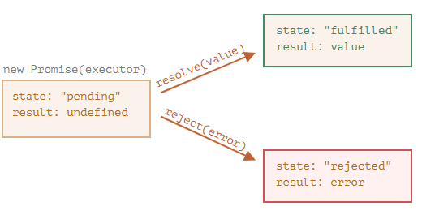

# Notes on Asynchronous Programming in JavaScript
Notes on asynchronous programming in JavaScript, based on [JAVASCRIPT.INFO - Promises, async/await](https://javascript.info/async).

## Constructor syntax
```js
let promise = new Promise(function(resolve, reject) {
    // executor (the producing code, "singer")
});
```
When `new Promise` is created, the executor runs automatically.

## Callbacks
When the executor obtains the result, it should call one of these callbacks:
* `Resolve(value)` – if the job is finished successfully, with result `value`
* `Reject(error)` – if an error has occurred, `error` is the error object

## `promise` object internal properties
The `promise` object has the following internal properties:
> ❗ *Internal* properties are not directly accessible.
* `state` – initially "`pending`", then changes to either "`fulfilled`" when `resolve` is called or "`rejected`" when `reject` is called. When the state has changed to "`fulfilled`" or "`rejected`", we say that the promise is `settled`.
* `result` – initially undefined, then changes to `value` when `resolve(value)` is called or `error` when `reject(error)` is called.



## Accessing the state / result
The properties `state` and `result` of the `Promise` object are internal. We can’t directly access them. We can use the methods `.then`/`.catch`/`.finally` for that. They are described below.

### .then
```js
promise.then(
  function(result) { /* handle a successful result */ },
  function(error) { /* handle an error */ }
);
```
None of the functions that can be passed to the `then` handler are mandatory, they can both be `null` (see explanation below catch).

### .catch
The call `.catch(errorHandlingFunction)` is a complete analog of `.then(null, errorHandlingFunction)`, it's just a shorthand.

### .finally
The call `.finally(f)` is used to always run `f`, when the promise is settled: whether it's `resolved` or `rejected`. Two important aspects of `finally`:
* The `finally` handler has no arguments, it doesn't get the outcome of the previous handler.
* The `finally` handler "passes through" the result or error to the next suitable handler.
* The `finally` handler shouldn't return anything. If it does, the returned value is silently ignored.

Example:
```js
new Promise((resolve, reject) => {
  setTimeout(() => resolve("value"), 2000);
})
  .finally(() => alert("Promise ready")) // triggers first
  .then(result => alert(result)); // <-- .then shows "value"
```